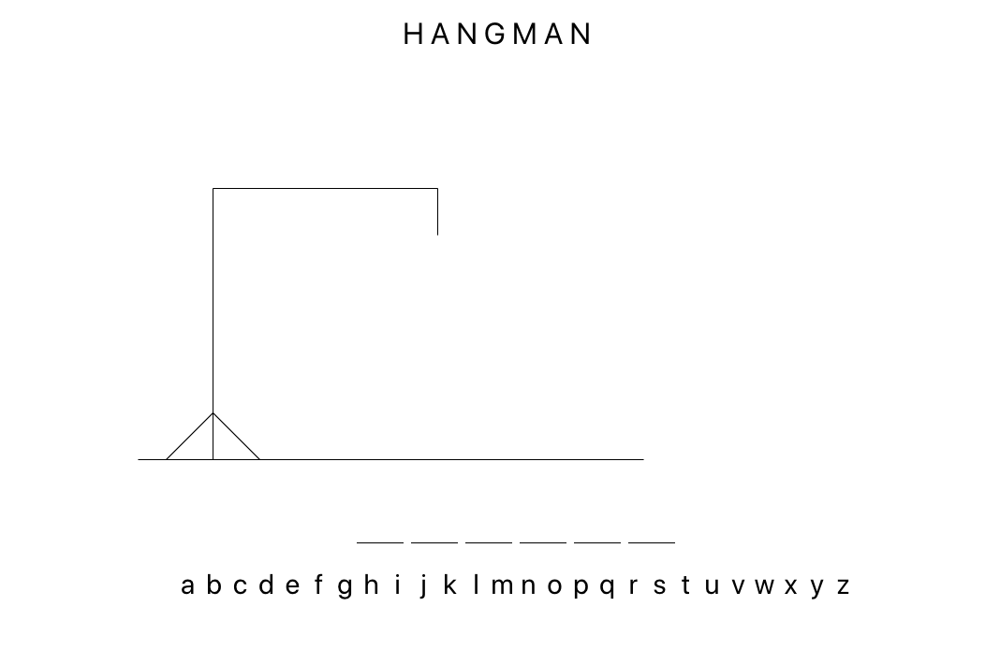
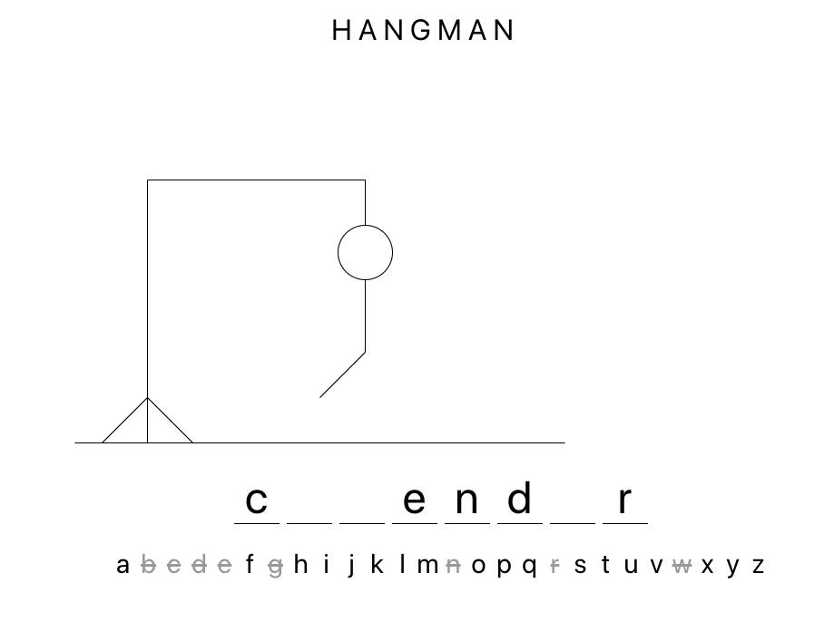
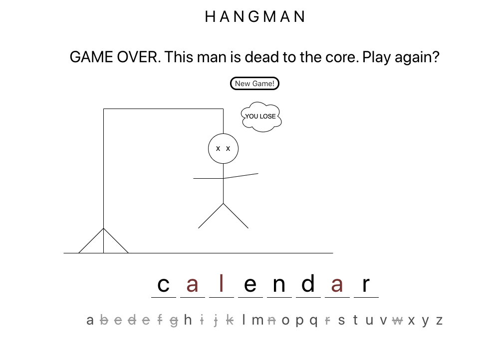
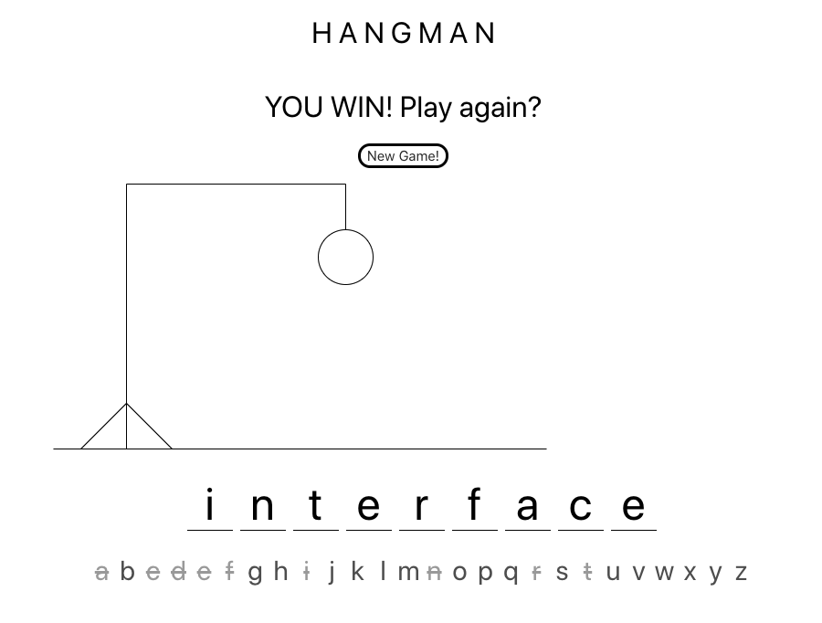
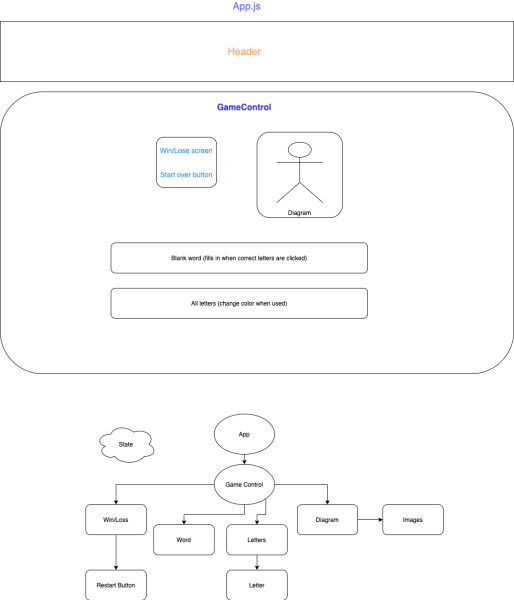

# Hangman

#### React and Redux Application that allows a user to play hangman, April, 24, 2020

#### _**Patrick Kille, Drake Wilcox, Joseph Wangemann**_

## User Interface
#### This is the classic game "Hangman" where a user guesses one letter at a time to try to spell out a secret or hidden word.  For every wrong guess, a part of a stick-figure body appears on the diagram until the seventh wrong guess which ends the game.  If every letter of the secret word is guessed, the user wins the game.

#### This is the start screen when the app first loads.  A secret word is chosen and the empty spaces signify how many letters are in the word.  The letters on the bottom line are clickable as guesses.

#### This is the screen during play.  Letters that have been guessed get crossed out and become unclickable.  Correct guesses are shown and incorrect guesses slowly add to the diagram until a head, body, two legs, two arms and eyes are shown.

When a player has made 7 incorrect guesses, the game is over and a new game button will appear.  All letters become unclickable and the secret word is shown with the letters that were still missing in red.

When a player guesses every letter in the secret word, a win game message is shown and a new game button will appear.

## Design and Development

#### WIREFRAME DESIGN AND COMPONENT TREE:

## Setup/Installation Requirements

#### Node install

###### For macOS:
_If Homebrew is not installed on your computer already, then install Homebrew by entering the following two commands in Terminal:_
* $ /usr/bin/ruby -e "$(curl -fsSL https://raw.githubusercontent.com/Homebrew/install/master/install)"
* $ echo 'export PATH=/usr/local/bin:$PATH' >> ~/.bash_profile

_Install Git with the following command:_
* $ brew install git

_Next, install Node.js by entering the following command in Terminal:_
* $ brew install node

###### For Windows:
_Please visit the [Node.js website](https://nodejs.org/en/download/) for installation instructions._

#### Install this application

_Clone this repository via Terminal using the following commands:_
* _$ cd desktop_
* _$ git clone {url to this repository}_
* _$ cd tap-room
_Then, confirm that you have navigated to the hangman project directory by entering "pwd" in Terminal._

_Next, install npm at the project's root directory via the following commands:_
* _$ npm install_
* _$ npm run build_

_Open the contents of the directory in a text editor or IDE of your choice (e.g., to open the contents of the directory in Visual Studio Code on macOS, enter the command "code ." in Terminal)._

## Technologies Used

* Git
* JavaScript
* npm
* Webpack
* React

### License

*This webpage is licensed under the MIT license.*

Copyright (c) 2020 **_Patrick Kille, Drake Wilcox, Joseph Wangemann_**